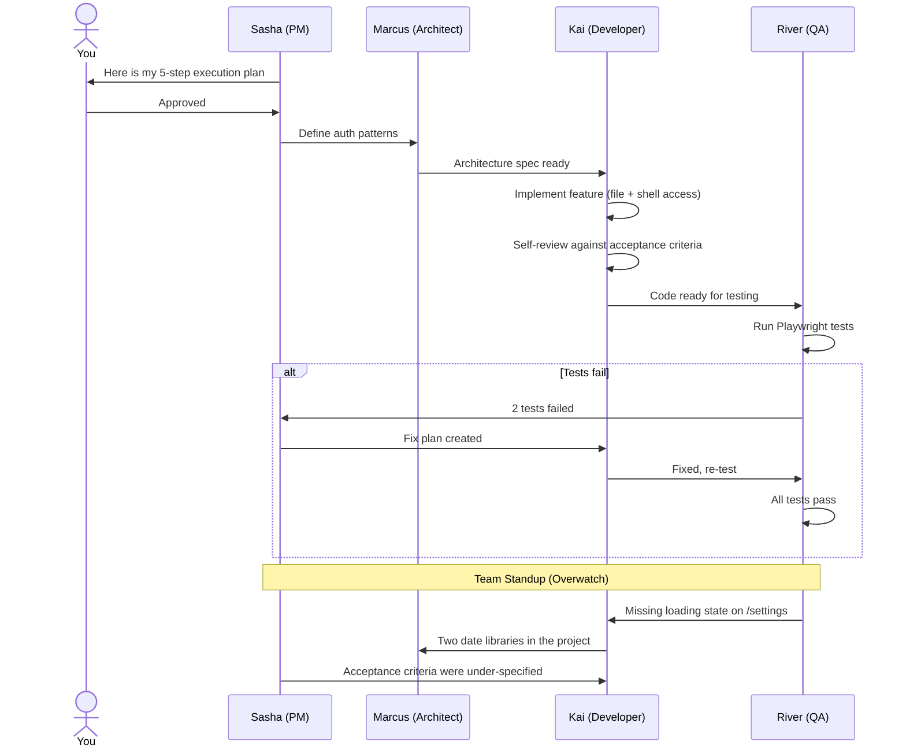
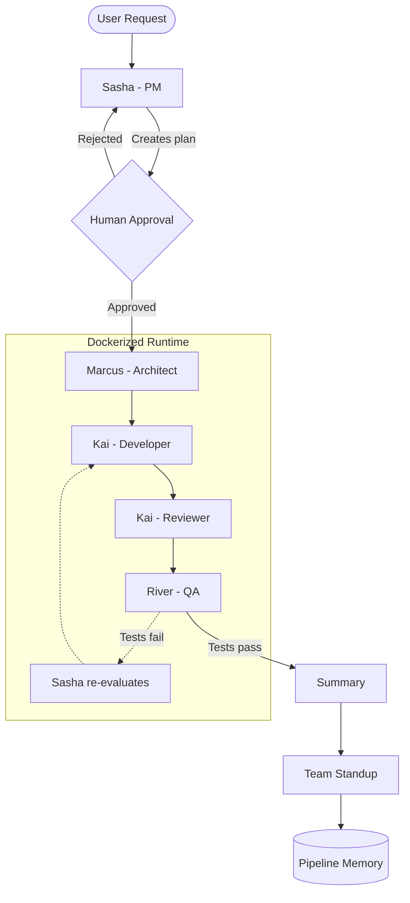

<p align="center">
  
</p>

<h1 align="center">Lilit</h1>
<p align="center"><strong>Your AI agents don't just code. They argue about it.</strong></p>
<p align="center">The open-source agentic workspace where autonomous AI agents plan, build, review, test, and hold each other accountable.</p>

<p align="center">
  
  
  
  
  
</p>

---

## The Problem

Every AI coding tool gives you a single agent working alone. One model, one perspective, no accountability. When it hallucinates, nobody catches it. When it cuts corners, nobody reviews it. When it misses edge cases, nobody tests for them.

**Lilit gives you a team.**

A PM who plans. An Architect who designs. A Developer who codes. A QA engineer who tests. A Reviewer who pushes back. And after every pipeline run, they hold a **standup** where they call out what everyone else missed.

## Why Lilit?

| | Single AI Assistant | Lilit Agent Squad |
| :--- | :--- | :--- |
| **Scope** | Single file / snippet | Entire repository |
| **Team** | Solo LLM | PM, Architect, Developer, QA, Reviewer |
| **Planning** | None | PM creates implementation plans with human approval gate |
| **Quality** | Hope for the best | QA runs real Playwright tests, Reviewer blocks bad code |
| **Cost** | Expensive (one model does everything) | Hybrid: Gemini plans (cheap), Claude codes (precise) |
| **Learning** | Starts fresh every time | Pipeline Memory feeds past insights into future plans |
| **Accountability** | None | Agents critique each other in post-pipeline standups |

## "My AI coding tool already has agents and skills"

Claude Code ships skills, task management, and sub-agents. Cursor has multi-file editing. Copilot Workspace generates plans. So why run a whole team?

Because **a single agent with a to-do list is not a team.**

A team has specialists who disagree, reviewers who block, and a QA engineer who runs your tests before you see the output. That feedback loop -- where one agent's output is another agent's input to critique -- is what produces reliable code, not a better prompt.

| | Single-Agent + Skills | Lilit |
| :--- | :--- | :--- |
| **Review** | Agent reviews its own code | Separate Reviewer agent with different evaluation criteria blocks bad code |
| **Testing** | You run tests after | QA agent runs Playwright tests *during* the pipeline, fails the build if they don't pass |
| **Fix cycles** | You read the error, re-prompt | PM reads the failure, creates a fix plan, Developer patches, QA re-tests (up to 3 rounds) |
| **Planning** | Inline task list, no approval gate | PM writes a structured plan, you approve it in the UI before anything executes |
| **Cost** | One model does everything | Gemini plans ($0.01), Claude codes ($0.15) -- hybrid routing per agent capability |
| **Memory** | Session-scoped context | RAG-backed pipeline memory -- past standup insights feed into future plans |
| **Accountability** | None -- agent marks its own work done | Post-pipeline standups where agents critique each other across domain boundaries |
| **Relationships** | None | Trust, tension, and rapport scores evolve between agents and influence future interactions |

The difference isn't features. It's architecture. A single agent with skills is a solo developer with good documentation. Lilit is a team with code review, QA, and a PM who won't let you ship without tests.

## Meet the Team

Every agent has a **personality**, a domain lens, and opinions. They aren't polite assistants -- they're opinionated specialists.

| Agent | Codename | Role | Personality |
|-------|----------|------|-------------|
| PM | **Sasha** | Plans execution, delegates tasks, gates quality | Direct, warm-but-firm. Ships iteratively. Will cut scope before missing a deadline. |
| Architect | **Marcus** | Defines patterns, tech stack, module boundaries | Deliberate, confident. Believes complexity is a bug. Will reject over-engineering. |
| Developer | **Kai** | Writes code, fixes bugs, implements features | Casual, enthusiastic, types-first. Fast but opinionated about code style. |
| QA | **River** | Tests with Playwright, catches edge cases | Methodical, dry humor. Obsessed with edge cases. Will fail your PR over a missing loading state. |

## How It Works

> **You:** *"Add user authentication with email/password"*



## Architecture

Lilit runs a **Hybrid AI Engine**:
- **Planning & Architecture**: Google Gemini (fast, cheap, good at reasoning)
- **Coding & Testing**: Claude Code CLI (file access, shell access, tool use)

The orchestrator resolves which provider + model to use per agent, with automatic **provider fallback** -- if Claude goes down mid-pipeline, the PM seamlessly switches to Gemini. If Gemini's rate-limited, transient errors retry automatically.



## Features

### Agent Standups (Overwatch)

After every pipeline run, each agent performs an **Overwatch scan** -- applying their domain expertise beyond their assigned task to the entire pipeline output. They write messages **to each other**, not status reports to you.

This solves the **Peripheral Vision Problem**: agents are laser-focused on their task, so they miss cross-cutting concerns. Standups force them to look sideways.

> **River (QA) &rarr; Kai (Developer):** "The /settings page has no loading skeleton. When the API call takes >500ms, users see a blank white panel. Add a Suspense boundary."
>
> **Kai (Developer) &rarr; Marcus (Architect):** "The settings page imports date-fns, but utils/format.ts already wraps dayjs. The project now has two date libraries."
>
> **Sasha (PM) &rarr; Kai (Developer):** "The review step flagged 2 issues already in the acceptance criteria. The code step didn't fully implement the spec."

Insights are classified by type: **cross-concern**, **pattern**, **process**, **drift**, or **risk**. Each is marked as actionable or observational. If an agent sees no tensions, silence is the correct output -- no performative filler.

### Pipeline Memory

Standup insights are ingested into a RAG memory store. When Sasha plans the next pipeline, she receives relevant past observations via vector similarity search. The system literally learns from its own retrospectives.

### Provider Auto-Fallback

If a provider fails mid-pipeline:
1. **Same-provider retry** after 2s (for transient errors like rate limits)
2. **Cross-provider fallback** to a capable alternative (Gemini for PM, Claude for Developer)
3. **Permanent errors** (auth failures, invalid models) skip retries immediately

The fallback is **capability-aware** -- Kai (Developer) won't fall back to Gemini because Gemini can't access files or run shell commands.

### Core Capabilities

- **Human-in-the-Loop**: Every plan requires your explicit approval before execution. You stay in control.
- **Budget Guardrails**: Set a max spend per pipeline run. No surprise bills.
- **Auto-Healing Pipeline**: If the build fails, agents read the error log and fix it themselves (up to 3 cycles).
- **Smart Stack Detection**: Automatically identifies your tech stack and loads relevant skills (Next.js patterns, React best practices, security scanning).
- **Skill System**: Agents are augmented with markdown skill files matched by tag overlap. PM can explicitly assign skills per task.
- **Live Log Streaming**: Watch agent output in real-time through the web UI.

## Real-World Performance

<!-- TODO: TO be updated -->
<!-- *Building a complete "To-Do List" app with Next.js & localStorage:*

| Metric | Value |
|--------|-------|
| Duration | 10 min 30 sec |
| Agents | PM, Architect, Developer, QA |
| Tests Run | 15 Playwright tests (100% pass) |
| Total Cost | **~$0.18** | -->

## Getting Started

### Prerequisites

- **Docker Desktop** (running)
- **Node.js 22+**
- **Claude Code CLI** ([install](https://docs.anthropic.com/en/docs/claude-code), authenticated)

### Quick Start

```bash
# Clone
git clone https://github.com/yourusername/lilit.git
cd lilit

# Configure
cp .env.example .env

# Setup (installs deps + starts Docker + runs migrations)
make setup

# Launch
make dev
```

Visit `http://localhost:3000` to create your first project.

### Environment Variables

| Variable | Required | Description |
|----------|----------|-------------|
| `DATABASE_URL` | Yes | PostgreSQL connection (default provided) |
| `GOOGLE_GENERATIVE_AI_API_KEY` | No | Enables Gemini provider for planning (without it, all agents use Claude) |
| `DEFAULT_BUDGET_LIMIT` | No | Default budget per pipeline run in USD (default: $10) |

## Tech Stack

- **Framework**: Next.js 16 (App Router), React 19, TypeScript 5
- **Styling**: Tailwind CSS 4, Shadcn UI
- **Database**: PostgreSQL 17 via Prisma 7
- **AI**: Claude Code CLI (coding) + Google Gemini via Vercel AI SDK (planning)
- **Testing**: Playwright (run by QA agent inside Docker)
- **Runtime**: Node.js 22, Docker

## Roadmap

**Done**
- [x] Full PM &rarr; Architect &rarr; Dev &rarr; Review &rarr; QA pipeline
- [x] Hybrid provider support (Gemini + Claude) with auto-fallback
- [x] Docker sandbox with live log streaming
- [x] Tech stack auto-detection + skill system
- [x] Agent personalities with codenames and voice styles
- [x] Post-pipeline standups with Overwatch scans
- [x] Pipeline Memory (RAG-backed, feeds into future planning)
- [x] Provider auto-fallback with error classification
- [x] Budget guardrails and cost tracking per agent run
- [x] Voice standups (TTS with agent-specific voices)
- [x] Live inter-agent messaging during pipeline execution
- [x] Adaptive pipeline (PM modifies plan mid-execution based on live feedback)

**In Progress**
- [ ] Rename Agents to Team Members in the UI
- [ ] Use context7 mcp and playwright
- [ ] Telegram integration

**Planned**
- [ ] Git integration (auto-create branches and PRs)
- [ ] Trend detection across standup history
- [ ] VS Code extension
- [ ] Multi-user auth
- [ ] Skill marketplace

## FAQ

**Is Lilit free?**
Open-source, MIT licensed. You pay only for your own API usage. The hybrid model keeps costs low (~$0.20 per feature).

**Can I use it with existing projects?**
Yes. Point Lilit at any local directory. It scans the stack and starts working.

**Where does the code run?**
Inside a Docker container on your machine, mounting your local directory for file persistence.

**What if I only have Claude Code CLI (no Gemini key)?**
Everything works. All agents use Claude. Adding a Gemini key enables cheaper planning, but it's optional.

**Do agents actually argue?**
The standups use tension-based prompting -- agents are asked to detect conflicts, not generate pleasantries. When River finds a missing loading state, she tells Kai directly. When Kai finds duplicate libraries, he tells Marcus. If nobody finds anything wrong, silence is the correct output.

## Contributing

Lilit is built with Next.js 16 (App Router), Tailwind CSS 4, Prisma 7, and Vercel AI SDK. See `CLAUDE.md` for the full architecture and coding conventions.

---

<p align="center">
  <i>Built with care by the Lilit team.</i>
</p>
