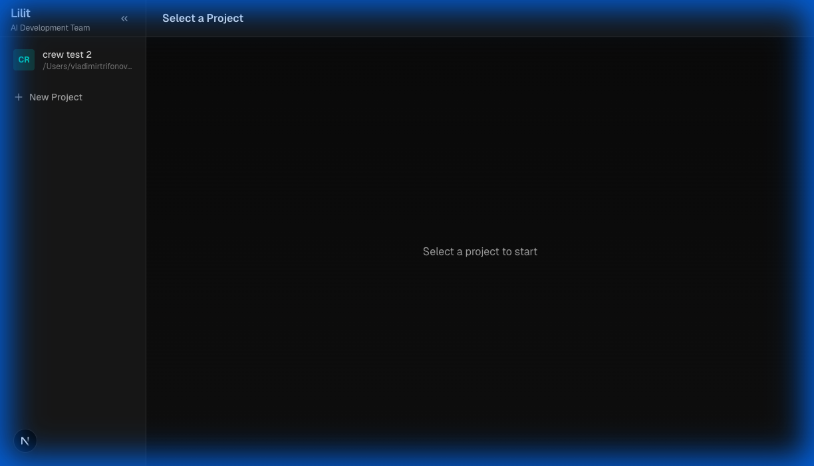

<p align="center">
  <br />
  <h1 align="center">🧞 Lilit</h1>
  <p align="center"><strong>Stop Coding Alone. Deploy Your AI Architecture Team.</strong></p>
  <p align="center">The open-source agentic workspace that turns natural language into enterprise-grade software.</p>
</p>

<p align="center">
  
  
  
  
  <a href="https://twitter.com/lilit_ai"></a>
  
</p>

<p align="center">
  
</p>

## 📚 Table of Contents

- [Introduction](#-introduction)
- [Why Lilit?](#-why-lilit)
- [Real-World Performance](#-real-world-performance)
- [Architecture](#-architecture)
- [Top Features](#-top-features)
- [Getting Started](#-getting-started)
- [Roadmap](#-roadmap)
- [FAQ](#-faq)

---

## 🔮 Introduction

**Lilit** isn't just a coding assistant—it's an **Autonomous Engineering Team**.

While tools like Copilot complete your lines, Lilit completes your **tickets**. It orchestrates a unique **Hybrid Agent Squad** (Gemini for Planning + Claude for Coding) to take a vague requirement and deliver a fully tested, working feature.

## 🆚 Why Lilit?

| Feature | 🤖 Typical AI Assistant | 🧞 Lilit Agent Squad |
| :--- | :--- | :--- |
| **Scope** | Single file / snippet | **Entire Project / Repository** |
| **Team** | Solo LLM | **PM, Architect, Dev, QA, & Reviewer** |
| **Planning** | None, just executes | **PM creates comprehensive Implementation Plans** |
| **Reliability** | Hallucinates often | **QA Agent runs Playwright tests & auto-fixes** |
| **Cost Strategy** | Expensive (all-in-one) | **Hybrid: Gemini (Free Planning) + Claude (Expert Coding)** |
| **Runtime** | Local Process | **Dockerized Sandbox (Safe & Reproducible)** |

## 📊 Real-World Performance

*Benchmark: Building a complete "To-Do List" app with Next.js & localStorage.*

-   **Duration**: 10 min 30 sec
-   **Agents Involved**: PM, Architect, Developer, QA
-   **Tests Run**: 15 Playwright tests (100% Pass)
-   **Total Cost**: **~$0.18** (Unbeatable efficiency via Hybrid model)

## 🏗️ Architecture

Lilit runs your agents in a **sandboxed, containerized environment** to ensure safety and consistency. It uses a **Hybrid Brain**:
-   **Planning/Architecture**: Google Gemini Pro (Fast, Cheap)
-   **Coding/Testing**: Anthropic Claude Sonnet (High Accuracy, Tool Use)

```mermaid
graph TD
    User([👤 User]) -->|1. Request| PM[👩‍💼 Product Manager]
    PM -- Gemini -->|2. Plan| User
    User -->|3. Approve| Arch[🏗️ Architect]
    
    subgraph "Dockerized Runtime"
        Arch -- Gemini -->|4. Spec| Dev[👨‍💻 Developer]
        Dev -- Claude -->|5. Code| FileSys[(📂 File System)]
        Dev -->|6. Review| Rev[👀 Reviewer]
        Rev -- Claude -->|7. Approve| QA[🕵️ QA Engineer]
        QA -- Playwright -->|8. Test| App{Runs App}
        QA -->|9. Pass/Fail| Dev
    end
```

## ✨ Top Features

### 🎙️ Daily Voice Standup (New!)
**"Your AI Team, Audible."**
Don't just read logs. Listen to your PM, Developer, and QA Agent discuss the project's status in a generated **Voice Meeting**.
-   **Audio Reports**: Agents speak their updates using distinct AI voices.
-   **Real Collaboration**: Hear the PM unblock the Dev, or the QA scolding the Architect.
-   **Podcast Mode**: Catch up on your project's progress while commuting or sipping coffee.

### Core Capabilities
- **🧠 Hybrid AI Engine**: Combines the best of Google Gemini (Speed/Cost) and Anthropic Claude (Coding) for maximum efficiency.
- **⚡ Agentic Sidebar**: Manage multiple concurrent projects without context switching.
- **🐳 Full Containerization**: Zero "it works on my machine" issues. The entire runtime is Dockerized.
- **💰 Budget Guardrails**: Set a max spend limit (e.g., $2.00) per run. No surprise bills.

### Advanced Engineering
- **🔄 Auto-Healing Pipeline**: If the build fails, the agents read the error log and fix it themselves (up to 3 retries).
- **🛠️ Smart Stack Detection**: Automatically identifies `package.json` or `requirements.txt` to inject the right skills (Next.js, Django, etc.).
- **🧪 Automated QA**: Runs real browser tests (Playwright) via a headless Chromium instance inside the container.

## ⚡ Getting Started

### Prerequisites

- **Docker Desktop** (Running) — *Crucial for the sandbox environment*
- **Node.js 24+**
- **Claude Code CLI** (Authenticated)

### Quick Install

```bash
# 1. Clone the repo
git clone https://github.com/yourusername/lilit.git
cd lilit

# 2. Configure environment
cp .env.example .env

# 3. Ignite the engine (Installs deps + Docker containers)
make setup

# 4. Launch Mission Control
make dev
```

Visit `http://localhost:3000` to create your first project.

## 🗺️ Roadmap

**Phase 1: Foundation (Complete ✅)**
- [x] Full PM -> Dev -> QA Pipeline
- [x] Hybrid Provider Support (Gemini + Claude)
- [x] Docker Sandbox & Sidebar UI
- [x] Tech Stack Auto-Detection

**Phase 2: Advanced Capabilities (In Progress 🚧)**
- [ ] **Gremlin Agent**: An agent that intentionally injects bugs to test if QA catches them.
- [ ] **Git Integration**: Auto-create feature branches and PRs upon success.
- [ ] **Port Isolation**: Dynamic port assignment for concurrent QA testing (avoiding :3000 conflicts).
- [ ] **Real-Time Streaming**: WebSocket updates for sub-second log streaming.

**Phase 3: Ecosystem (Planned 🔮)**
- [ ] **VS Code Extension**
- [ ] **Multi-User Auth**: NextAuth + Per-user API keys.
- [ ] **Skill Marketplace**: Install community agent skills.

## ❓ FAQ

**Q: Is Lilit free?**
A: Lilit is open-source. You only pay for your own API usage. The Hybrid model keeps costs extremely low (~$0.20 per feature).

**Q: Can I use it with existing projects?**
A: Yes! Point Lilit to any local directory. It will scan the stack and start working.

**Q: Where does the code run?**
A: Inside a Docker container on your machine, mounting your local directory for persistence.

## 🤝 Contributing

We love contributions! Lilit is built with:
- **Next.js 15** (App Router)
- **Tailwind CSS**
- **Prisma**
- **LangChain / AI SDK**

Check out `CONTRIBUTING.md` to get started.

## 🌟 Star History

[](https://star-history.com/#yourusername/lilit&Date)

---

<p align="center">
  <i>Built with ❤️ by the Lilit Team</i>
</p>
